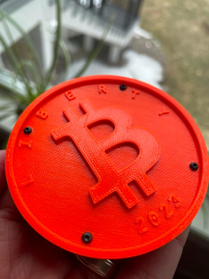
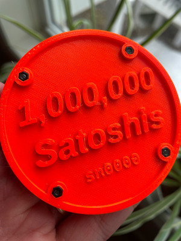
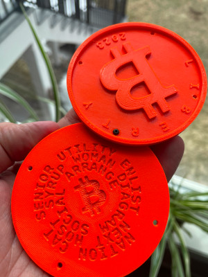
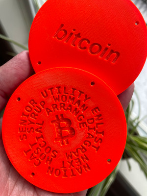

# Bitcoin Legacy Gift Coins






The Bitcoin Legacy Gift Coin is a custom designed two-piece coin engineered to
securely and safely gift a Bitcoin cold wallet in a tangible form, reminiscent
of gifting gold.

This repo contains the 3d models which consists of two coins that embed a
bitcoin seed phrase.

The first coin is a generic "Bitcoin" coin, containing a bitcoin logo on the
front and the embedded word "bitcoin" on the reverse.

The second coin contains a unique 12-word (128 bit) wallet seed phrase, and the
reverse displays the denomination that the wallet contains (such as "1 Bitcoin"
or "1,000,000 Satoshis").

The coins are designed to be joined together, keeping the seed phrase secure
from casual viewing.

An actual _production run_ should be done from a dedicated offline system that
is securely erased after the run.

## Developing

At a high level, this repo uses Python and the
[SolidPython2](https://pypi.org/project/solidpython2/) library to generate
[OpenSCAD](https://openscad.org/) files which render to 3d printable STL files
which are then converted to G-Code files suitable for 3d printing.

> Python -> SCAD -> STL -> G-Code

This repo was developed on a linux system with the following tools.
- Python 3
  - pipenv
- [OpenSCAD](https://openscad.org/)
- [Prusa Slicer](https://www.prusa3d.com/page/prusaslicer_424/)

On ubuntu linux 22.10, the following commands took care of the prerequisites:

```
sudo apt install python3 openscad python-is-python3 python3-pip pipenv libgmp-dev
sudo snap install prusa-slicer
```

Once the above prerequisites are installed, run the following To get started with development, install the above tools and then run the following:

```
pipenv install
make
```

Running "make" will generate top_coin files from top_coin.py, and sample
bottom_coin files (with serial number "0000") from bottom_coin.py. Note that
rendering the bottom coin takes ~5 minutes; run `make quick_build` for a faster
iteration loop that just generates the scad file.

## Production Run

To perform a production run, prepare an offline system and refer to
`production_run.sh`.

### Prepare An Offline System

Install your favorite linux distribution on a new system from scratch. Bring
the system fully up to date, and then install the prerequisites for this
project. Once you can successfully run `make`, you may disconnect the system
from the internet.

### Perform a Production Run

Once offline, modify `production_run.sh` with the set of serial numbers to
generate. Run `./production_run.sh`.

There are two directories created: `bottom_coins/` and `coin_data/`.

`bottom_coins/` contains all of the wallet coin files with seed phrases. These
files are all highly sensitive and should be treated with the utmost caution.
Transfer these files to an sdcard for offline 3d printing. When done printing,
securely erase or (better) physically shred the sdcard.

`coin_data/` is not sensitive data; it contains the public bitcoin wallet
addresses for all of the coins. This directory should be copied to a thumb
drive and transferred to an online computer for safe keeping. You will use
these addresses to fund the coins.

Please spot check the coins and addresses by picking one coin to restore to a
hardware wallet and verify that the public wallet address matches the address
given by the hardware wallet. Be sure to use derivation path `"m/84'/0'/0'`
with p2wpkh style addresses (these are both typically the most common and
recommended options in 2023). You may want to create an extra coin for this
purpose.

### Coin Assembly

If using the recommended nuts, please be aware that the nut recepticles in the
print are slightly undersized. This is intentional because it allows the nut to
be heat-sunk into the receptical. To sink the nut, use a soldering iron to heat
up the nut and gently press it into the hole until it is flush with the face of
the coin. This takes a little practice, so be prepared to ruin your first coin.

## Dimensions

All dimensions are denominated in mm.

- 3in diameter in total (76.2mm)
- 5mm coin thickness each (10mm when combined).
- The coin's rim is 2.5mm
- The coin is logically divided into 5 layers, 1mm each:
  - bottom 1mm: This needs to be mostly solid, but material may be removed for writing
  - second 1mm: This should remain in tact
  - third 1mm: This should remain in tact
  - fourth 1mm: This should be open, except where writing exists
  - fifth 1mm: This should be open, except where writing exists
- Screw: https://www.mcmaster.com/91239A705/
- Nut: https://www.mcmaster.com/98676A310/

## Repository Layout

### Top Coin

The top coin is (intentionally) generic. It matches the bottom coin, but all
top coins are the same and interchangable.
- `top_coin.py`: Defines the top coin design using the solid python library.
- `top_coin.scad`: Generated when top_coin.py runs; can be loaded in OpenSCAD
  for viewing.
- `top_coin.stl`: Generated by rendering top_coin.scad and outputing stl; can
  be loaded into PrusaSlicer.
- `top_coin.gcode`: Generated by PrusaSlicer. The 6x file has 6 copies of the
  stl laid out on the print bed for efficiency.

### Bottom Coin

The bottom coin contains a wallet seed phrase, and is therefore sensitive and
should never be checked into git or even placed on an online system.
- `bottom_coin.py`: Generates a bottom coin with a securely generated unique
  seed phrase, and writes it to `bottom_coins/`.
- `production_run.sh`: Runs `bottom_coin.py` to generate a set of unique bottom
  coin scad files, and then converts the scad file to an stl file, and then
  converts the stl to a singular gcode file as well as a 2x gcode file.

`bottom_coin.py` will also output a safe-to-share json file in `coin_data/`
which consists of a serial number and a wallet public address. This is the only
place the public address will appear, so it's important to keep the serial
number, coin seed phrase, and public wallet address together. This is why the
serial number exists - to ensure that the public wallet address and the coin
that it belongs to are tracked.

## Reference

- Archimedean Spiral https://openhome.cc/eGossip/OpenSCAD/ArchimedeanSpiral.html

## Phrase Length

By generating a few billion seed phrases (I ran a script overnight on my PC),
we can find exceptionally long seed phrases. The longest phrases seem to top
out at about 100 characters (spaces included). These do fit on the rendered
bottom coin with a little room to spare, so phrase length is not an ongoing
concern. Here are some example long phrases.
- (99): `shuffle actress blouse satisfy satisfy elevator express dinosaur
  champion mountain faculty decrease`
- (100): `describe absurd awesome dinosaur category scatter hundred drastic
  distance veteran interest exercise`
- (101): `cupboard assault practice plastic vessel february mechanic regular
  struggle describe seminar artefact`
